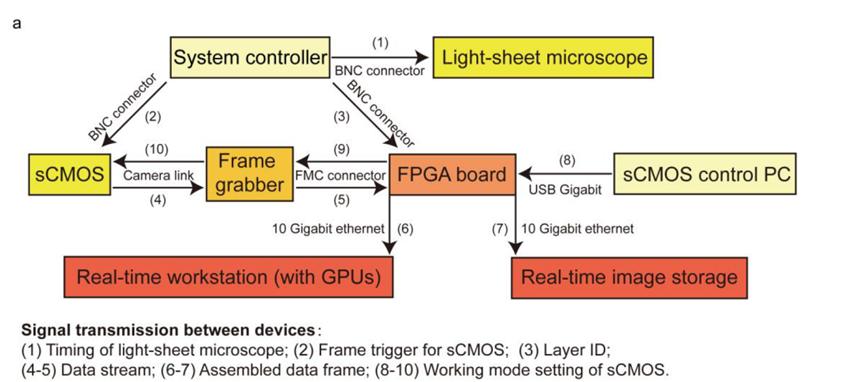

# Real-time_Large-scale_Feedback


**Folder Describtion：**

|Class|Details|
|---|---|
|System controller||
|FPGA|cameraControl, FPGA impl|
|||
|Real-time workstation (with GPUs)||
|Real-time image storage||
|ROIsegmentation&clustering||

# **1. Introduction**

The real-time analysis system is an FX architecture based on FPGA and GPU. What runs on FPGA is named F Engine and what runs on GPU is named X Engine. The F Engine acquires data from sensors of different types, performs optional pre-processing (filtering, FFT, etc), rearranges and packages the data into standard format to transfer to the X Engine. The F Engine is designed to be compatible with many different sensor interfaces, which are all mounted to the FPGA board through FPGA Mezzanine Card (FMC) or FMC+.

# **2. Installation and build**
## 2.1 Camera
The sCMOS is controlled by the FPGA using the program camera_gui.py.
## **2.2 FPGA**
The FPGA program is running on Vivado 2016.1. Its source code (.v/.xcix) was developed for the XC7K7325T-2FFG900 FPGA from Xilinx.  <br />
The FPGA program works in cooperation with the Camera control program running on the host PC, camera_gui.py. This python program starts and stops the camera, and sets its Exposure time. Before running, the python program should be supplied with the USB port name of the FMC board on the host PC, while the port name is obtained by installing the serial library. The program can run on either python2 or python3, where the tkinter library name is different. 

* Python 2.x
```
import Tkinter as tk
```
* Python 3.x
```
import tkinter as tk
```
## 2.3 Real-time workstation (with GPUs)
Both focusing and Registration run on the Real-time workstation (with GPUs). The source code is developed targeted on qtcreator. The deployment environment is as follows:<br />

 <table style="width:800pt"> <!--StartFragment--> 
 <colgroup>
  <col width="72" style="width:54pt"> 
  <col width="74" style="mso-width-source:userset;mso-width-alt:2368;width:56pt"> 
  <col width="71" style="mso-width-source:userset;mso-width-alt:2272;width:53pt"> 
 </colgroup>
 <tbody>
  <tr height="55"> 
   <td colspan="2" class="xl63">Environment</td> 
   <td class="xl63">Vendor and Catalog</td> 
  </tr> 
  <tr height="20"> 
   <td rowspan="3" class="xl63">Hardware environment</td> 
   <td class="xl63">Server</td> 
   <td class="xl63">Dell 7910</td> 
  </tr> 
  <tr height="20"> 
   <td class="xl63">GPUs</td> 
   <td class="xl63">P100 ×2</td> 
  </tr> 
  <tr height="55"> 
   <td class="xl63">Network card</td> 
   <td class="xl63">Intel X520 10GbE 2ports</td> 
  </tr> 
  <tr height="37"> 
   <td rowspan="5" class="xl63">Software environment</td> 
   <td class="xl63">Os</td> 
   <td class="xl63">Ubuntu 16.04</td> 
  </tr> 
  <tr height="55"> 
   <td class="xl63">Cuda</td> 
   <td class="xl63">cuda_10.2.89_440.33.01_linux</td> 
  </tr> 
  <tr height="73"> 
   <td class="xl63">Nvidia driver</td> 
   <td class="xl63">NVIDIA-Linux-x86_64-440.64.00</td> 
  </tr> 
  <tr height="37"> 
   <td class="xl63">Network driver</td> 
   <td class="xl63">ixcap</td> 
  </tr> 
  <tr height="37"> 
   <td class="xl63">Development tools</td> 
   <td class="xl63">Qtcreator 5.9</td> 
  </tr> <!--EndFragment--> 
 </tbody>
</table>


Note: The server's hyper-threading feature needs to be turned off.<br />
## **2.4 Real-time image storage**
Store runs on the Real-time image storage. The Store source code is compiled by g++ on ubuntu 16.04.<br />
Hardware environment: Dell 7920 Server and Intel X520 10GbE 2ports network card.

## **2.5 ROIsegmentation&clustering**
The Matlab programs FastultraSupervoxelSegmentation.m and FastultraSupervoxelSegmentationPlane.m are developed in and run on Matlab.  They work on average fluorescence images, generate the positions of roi’s corresponding to brain-wide neurons, and store them in the RegConf.txt for Registration.  FastultraSupervoxelSegmentation.m works in volumetric imaging and FastultraSupervoxelSegmentationPlane.m works in single-plane imaging.<br />
FastWeightAssignment1.m and FastWeightAssignmentPlane.m are developed in and run on Matlab. They work on the neuronal activities extracted by Registration in real time, and generate a specific RegConf.txt for each ensemble. In each RegConf.txt, the neurons are assigned with weights based on their similarity to the mean response of the corresponding ensemble. FastWeightAssignment1.m works in volumetric imaging and FastWeightAssignmentPlane.m works in single-plane imaging.
# **3. Operation Procedure**
## 1. Experiment Preparation
1.1 Start the System controller program, LightSheetController, after turning on the light-sheet microscope.<br />
1.2 Set the sCMOS to the ‘Synchronous readout’ mode using *camera_gui.py* program in the FPGA folder.<br />
1.3 Focusing on the volume/plane of interest by running LightSheetController in *Mode 2A* (volumetric) or the *XYOnly* mode (single plane) and Focusing/Focusing_3d in the Registration folder.<br />
## 2. Neuron Segmentation from Template Images
2.1 Use the program registration_1w4c and the LightSheetController in *Mode 2A* (volumetric) or the *XYOnly* mode (single plane) to record 10 volumes (volumetric) or 50 images (single plane) for generating the template images. See readme_registration-RecvConf.pdf for setting the necessary parameters.<br />
2.2 Obtain the template images by averaging the recorded images using ImageJ.<br />
2.3 Segment neurons in MATLAB using the program *FastultraSpravoxelSegmentationPlane.m*. The resulting segmentation is saved in a RegConf.txt file. See readme_registration-RegConf.pdf for the parameter meanings.<br />
## 3. Optogenetics (For Optogenetics Experiments Only)
Load the DMD pattern corresponding to optogenetic target using the LabView program *DMD Controller v1.3_master_mode.vi*.<br />
## 4. Record Spontaneous Neuronal Activity for Clustering
4.1 Reset the sCMOS.<br />
4.2 Record 10 volumes (volumetric) or 50 images (single plane) for the template images for real-time registration by running the program registration_1w4c and the LightSheetController in *Mode 2A* (volumetric) or the *XYOnly* mode (single plane).<br />
4.3 Reset the sCMOS.<br />
4.4 Record images for 10 minutes and wait for the recording program to end automatically. The online extracted neuronal activities will be saved in the roi_x.txt files, where x represents the layer ID.<br />
4.5 Assign the neurons with weights in MATLAB using the program *FastWeightAssignment1.m*.<br />
4.6 Update the event detection threshold in the RegConf.txt file.<br />
## 5. Closed-Loop Experiment
5.1 Reset the sCMOS.<br />
5.2 Record template images as above.<br />
5.3 Reset the sCMOS.<br />
5.4 Record in volumetric or single plane using the program registration, controlled by the LabView program Controller in the EventDetectionMode.<br />
## 6. Image Storage without Real-Time Processing 
Save raw images without real-time registration using the program Store, which should be started together with registration.<br />
